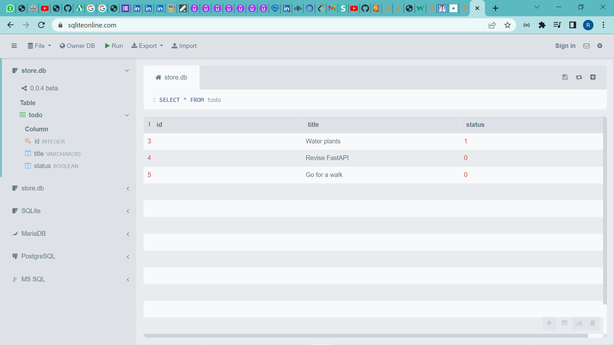

<h1 align="center">
  🏷️ Todo List
</h1>

<p align="center"> A todo list API built in Flask </p>

<br>

## 🚀 Tech Stack:
* Flask (microframework)
* SQLAlchemy (ORM)
* sqlite (DB)
* Semantic-UI (styling)


## 🛠 Installation

### Clone this repo
```
git clone "https://github.com/RhoNit/todo-list-api.git"
```

<hr>

### Navigate to the ```/backend``` sub-directory of the repo
```
cd backend
```

<hr>

### Create a virtual environment
```
python -m venv new-env
```

<hr>

### Activate the virtual environment
```
.\new-env\Scripts\activate     # for Windows

source new-env/bin/activate    # for Linux distros and macOS
```

<hr>

### Install all dependencies mentioned inside ```requirements.txt``` file
```
pip install -r requirements.txt
```

<hr>

### Instead of calling ```create_all()``` in your code, you can also call it manually in the shell. Use ```flask shell``` to start a Python shell to that already has an app context created or db imported
```
$ flask shell
>>> db.create_all()
```

<hr>

### Exit out from the flask shell
```
>>> exit()
```

<hr>

### [OR] If you're using a plain python shell, then push the ```app_context()``` manually 
```
$ python
>>> from app import app, db
>>> app.app_context().push()
>>> db.create_all()
```

<hr>

### Exit out from the python shell
```
>>> exit()
```

<hr>

### Run the application
```
python app.py
```

<hr> 

### Visit ```localhost:5000```
```
http://127.0.0.1:5000
```

## 🚀 APIs/Routes
* ### Add a todo
```
POST /create
```
<hr>

* ### Update the completeness status of a todo by Id
```
PUT /mark/{id}
```
<hr>

* ### Delete a todo by Id
```
DELETE /delete/{id}
```
<hr>

* ### List all todos
```
GET /
```
<br>

## 🛢️ Database Schema and App preview

<hr>

<br>

## 🎯 Bullseye (trying to build a Docker Image and push that to Docker Hub)
- Trying to Dockerize the application
- But facing some issues
- Working on it

